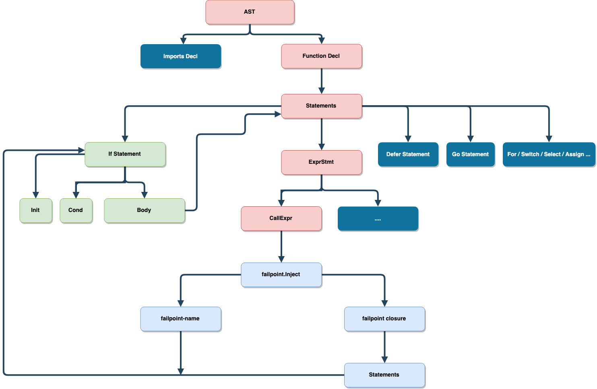

# failpoint
[](https://github.com/pingcap/failpoint/blob/master/LICENSE)
[](https://golang.org/)
[](https://goreportcard.com/report/github.com/pingcap/failpoint)
[](https://travis-ci.com/pingcap/failpoint)
[](https://codecov.io/gh/pingcap/failpoint)

An implementation of [failpoints][failpoint] for Golang.

[failpoint]: http://www.freebsd.org/cgi/man.cgi?query=fail

## Features

- Define failpoint in valid Golang code, not comments or anything else
- Failpoint does not have any extra cost

    - Will not take effect on regular logic
    - Will not cause regular code performance regression
    - Failpoint code will not appear in the final binary

- Failpoint routine is easy to write/read and checked by a compiler
- Generated code by failpoint defination is easy to read
- Will Keep the line number the same (for easy debug)
- Support parallel tests with context.Context

## Key concepts

- Failpoint

    Faillpoint is a code snippet which only executes in corresponding failpoint is active.
    The closure will never execute if we `failpoint.Disable("failpoint-name-for-demo")`.

    ```go
    var outerVar = "declare in outer scope"
    failpoint.Inject("failpoint-name-for-demo", func(val failpoint.Value) {
        fmt.Println("unit-test", val, outerVar)
    })
    ```

- Marker functions

    - It is just an empty function

        - To hint rewriter to rewrite with equality statement
        - Receive some parameters as the rewrite rule
        - It will be inline in compile time and emit nothing to binary (zero cost)
        - The closure can access external variables in valid syntax which called capture, and
        the converted IF statement is still legal because of all of captured - variables
        become an outer scope variable access. That’s awesome

    - It is easy to write/read 
    - Introduce a compiler check for failpoints which cannot compile in regular mode if failpoint code is invalid

- Marker funtion list

    - `func Inject(fpname string, fpblock func(val Value)) {}`
    - `func Inject(fpname string, fpblock func(ctx context.Context, val Value)) {}`
    - `func Break(label ...string) {}`
    - `func Goto(label string) {}`
    - `func Continue(label ...string) {}`
    - `func Fallthrough() {}`
    - `func Label(label string) {}`

## How to inject a failpoint to you program

You can call `failpoint.Inject` to inject a failpoint to the call site, which `failpoint-name` is
used to trigger the failpoint and `failpoint-closure` will be expanded as the body of the IF statement.

```go
failpoint.Inject("failpoint-name", func(val failpoint.Value) {
    fmt.Println("unit-test", val)
})
```

The converted code looks like:

```go
if ok, val := failpoint.Eval("failpoint-name"); ok {
    fmt.Println("unit-test", val)
}
```

The `failpoint.Value` is the value that pass by `failpoint.Enable("failpoint-name", "return(5)")`
which can be ignored.

```go
failpoint.Inject("failpoint-name", func(_ failpoint.Value) {
    fmt.Println("unit-test")
})
```

OR

```go
failpoint.Inject("failpoint-name", func() {
    fmt.Println("unit-test")
})
```

And the converted code looks like:

```go
if ok, _ := failpoint.Eval("failpoint-name"); ok {
    fmt.Println("unit-test")
}
```

Also, the failpoint closure can be a function which take `context.Context`. You can
do some customized things with `context.Context` like control whether a failpoint is
active in parallel tests or other cases. e.g.

```go
failpoint.Inject("failpoint-name", func(ctx context.Context, val failpoint.Value) {
	fmt.Println("unit-test", val)
})
```

The converted code looks like:

```go
if ok, val := failpoint.Eval("failpoint-name", ctx); ok {
	fmt.Println("unit-test", val)
}
```

Of course you can ignore `context.Context` even if no meaningful because of it will generate the
same code as no `context.Context` parameter. e.g.

```go
failpoint.Inject("failpoint-name", func(_ context.Context, val failpoint.Value) {
	fmt.Println("unit-test", val)
})
```

Becomes

```go
if ok, val := failpoint.Eval("failpoint-name"); ok {
	fmt.Println("unit-test", val)
}
```

You can control a failpoint by failpoint.WithHook

```go
func (s *dmlSuite) TestCRUDParallel() {
    sctx := failpoint.WithHook(context.Backgroud(), func(ctx context.Context, fpname string) bool {
        return ctx.Value(fpname) != nil // Determine by ctx key
    })
    insertFailpoints = map[string]struct{} {
        "insert-record-fp": {},
        "insert-index-fp": {},
        "on-duplicate-fp": {},
    }
    ictx := failpoint.WithHook(context.Backgroud(), func(ctx context.Context, fpname string) bool {
        _, found := insertFailpoints[fpname] // Only enable some faipoints
        return found
    })
    deleteFailpoints = map[string]struct{} {
        "tikv-is-busy-fp": {},
        "fetch-tso-timeout": {},
    }
    dctx := failpoint.WithHook(context.Backgroud(), func(ctx context.Context, fpname string) bool {
        _, found := deleteFailpoints[fpname] // Only disable failpoints 
        return !found
    })
    // ... other dml parallel test cases
    s.RunParallel(buildSelectTests(sctx))
    s.RunParallel(buildInsertTests(ictx))
    s.RunParallel(buildDeleteTests(dctx))
}
```

If you use failpoint in loop context, maybe you would use ohter marker functions

```go
failpoint.Label("outer")
for i := 0; i < 100; i++ {
    inner:
        for j := 0; j < 1000; j++ {
            switch rand.Intn(j) + i {
            case j / 5:
                failpoint.Break()
            case j / 7:
                failpoint.Continue("outer")
            case j / 9:
                failpoint.Fallthrough()
            case j / 10:
                failpoint.Goto("outer")
            default:
                failpoint.Inject("failpoint-name", func(val failpoint.Value) {
                    fmt.Println("unit-test", val.(int))
                    if val == j/11 {
                        failpoint.Break("inner")
                    } else {
                        failpoint.Goto("outer")
                    }
                })
        }
    }
}
```

Which will generate belowing code:

```go
outer:
    for i := 0; i < 100; i++ {
    inner:
        for j := 0; j < 1000; j++ {
            switch rand.Intn(j) + i {
            case j / 5:
                break
            case j / 7:
                continue outer
            case j / 9:
                fallthrough
            case j / 10:
                goto outer
            default:
                if ok, val := failpoint.Eval("failpoint-name"); ok {
                    fmt.Println("unit-test", val.(int))
                    if val == j/11 {
                        break inner
                    } else {
                        goto outer
                    }
                }
            }
        }
    }
```

You may confused that why don't  we use `label` `break` `continue` `fallthrough` directly
instead of to use failpoint marker functions. 

- Unused label will occurred compiler error in compile phrase if a label is just used in
failpoint closure.
- The `break` `continue` can only be used in loop context, it is not legal golang code 
if we use it in closure directly.

### Some complicated failpoints demo

- Inject failpoint to IF INITIAL statement or CONDITIONAL expression

```go
if a, b := func() {
    failpoint.Inject("failpoint-name", func(val failpoint.Value) {
        fmt.Println("unit-test", val)
    })
}, func() int { return rand.Intn(200) }(); b > func() int {
    failpoint.Inject("failpoint-name", func(val failpoint.Value) int {
        return val.(int)
    })
    return rand.Intn(3000)
}() && b < func() int {
    failpoint.Inject("failpoint-name-2", func(val failpoint.Value) {
        return rand.Intn(val.(int))
    })
    return rand.Intn(6000)
}() {
    a()
    failpoint.Inject("failpoint-name-3", func(val failpoint.Value) {
        fmt.Println("unit-test", val)
    })
}
```

Will generate something like this:

```go
if a, b := func() {
    if ok, val := failpoint.Eval("failpoint-name"); ok {
        fmt.Println("unit-test", val)
    }
}, func() int { return rand.Intn(200) }(); b > func() int {
    if ok, val := failpoint.Eval("failpoint-name"); ok {
        return val.(int)
    }
    return rand.Intn(3000)
}() && b < func() int {
    if ok, val := failpoint.Eval("failpoint-name-2"); ok {
        return rand.Intn(val.(int))
    }
    return rand.Intn(6000)
}() {
    a()
    if ok, val := failpoint.Eval("failpoint-name-3"); ok {
        fmt.Println("unit-test", val)
    }
}
```

- Inject failpoint to the SELECT statement to make it block one case if failpoint is active

```go
func (s *StoreService) ExecuteStoreTask() {
    select {
    case <-func() chan *StoreTask {
        failpoint.Inject("priority-fp", func(_ failpoint.Value) {
            return make(chan *StoreTask)
        })
        return s.priorityHighCh
    }():
        fmt.Println("execute high priority task")

    case <- s.priorityNormalCh:
        fmt.Println("execute normal priority task")

    case <- s.priorityLowCh:
        fmt.Println("execute normal low task")
    }
}
```

Will generate something like this:

```go
func (s *StoreService) ExecuteStoreTask() {
    select {
    case <-func() chan *StoreTask {
        if ok, _ := failpoint.Eval("priority-fp"); ok {
            return make(chan *StoreTask)
        })
        return s.priorityHighCh
    }():
        fmt.Println("execute high priority task")

    case <- s.priorityNormalCh:
        fmt.Println("execute normal priority task")

    case <- s.priorityLowCh:
        fmt.Println("execute normal low task")
    }
}
```

- Inject a failpoint to dynamically extend SWITCH CASE arms

```go
switch opType := operator.Type(); {
case opType == "balance-leader":
    fmt.Println("create balance leader steps")

case opType == "balance-region":
    fmt.Println("create balance region steps")

case opType == "scatter-region":
    fmt.Println("create scatter region steps")

case func() bool {
    failpoint.Inject("dynamic-op-type", func(val failpoint.Value) bool {
        return strings.Contains(val.(string), opType)
    })
    return false
}():
    fmt.Println("do something")

default:
    panic("unsupported operator type")
}
```

Will generate something like this:

```go
switch opType := operator.Type(); {
case opType == "balance-leader":
    fmt.Println("create balance leader steps")

case opType == "balance-region":
    fmt.Println("create balance region steps")

case opType == "scatter-region":
    fmt.Println("create scatter region steps")

case func() bool {
    if ok, val := failpoint.Eval"dynamic-op-type"); ok {
        return strings.Contains(val.(string), opType)
    })
    return false
}():
    fmt.Println("do something")

default:
    panic("unsupported operator type")
}
```

- More complicated failpoint

    - There are more complicated failpoint sites that can be injected to
        - for the loop INITIAL statement, CONDITIONAL expression and POST statement
        - for the RANGE statement
        - SWITCH INITIAL statement
        - …
    - Anywhere you can write a function literal

## Implementation details

- Define a group of marker functions
- Parse imports and prune a source file which does not import failpoint
- Traverse AST to find marker function calls
- Marker function call will be rewritten with an IF statement, which calls failpoint.Eval to determine whether a failpoint is active and executes failpoint code if the failpoint is enabled


